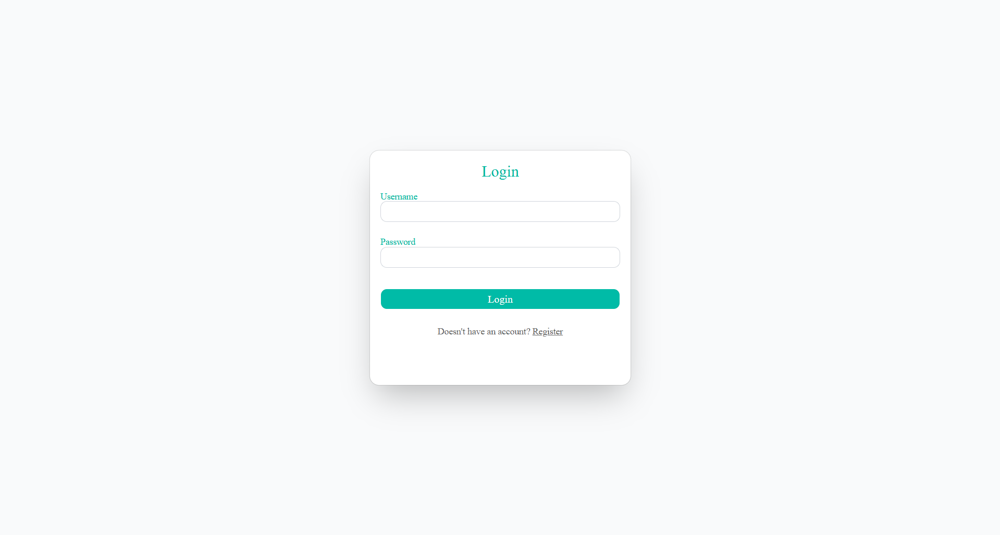
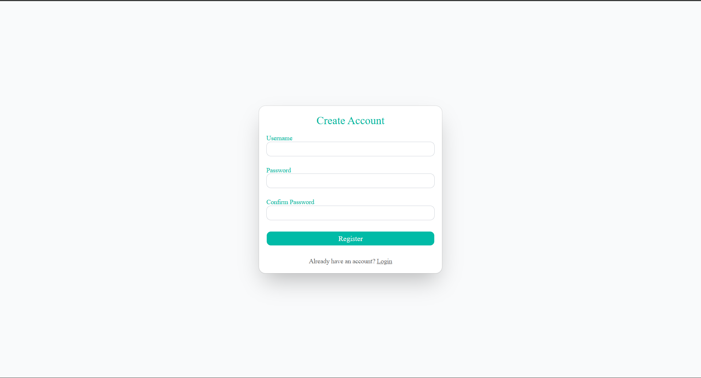
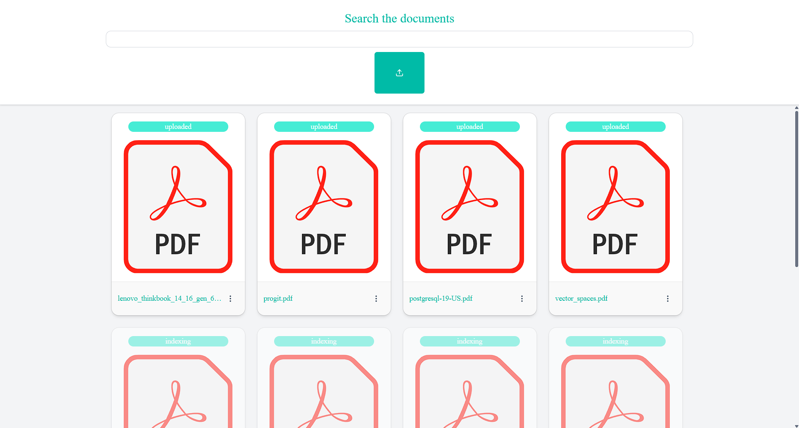
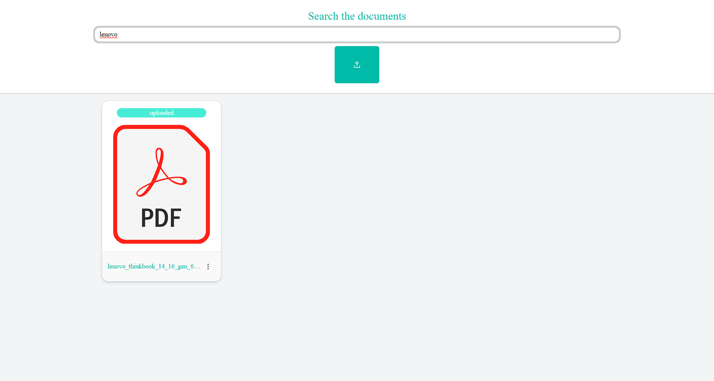
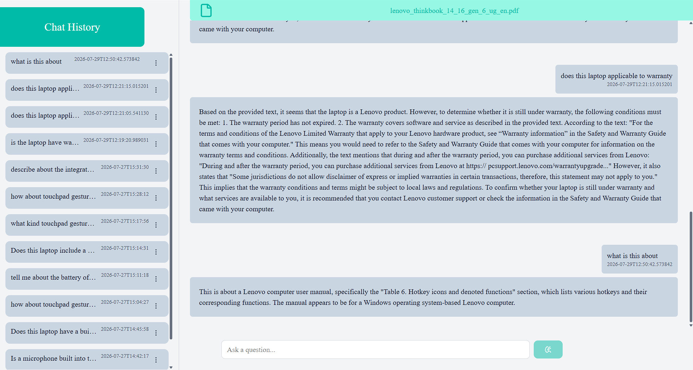

# 📚 RAG Chatbot Web App

A modern, responsive web application for interacting with a Retrieval-Augmented Generation (RAG) chatbot. Users can securely upload documents, manage their knowledge base, and chat with an AI assistant that answers questions using the uploaded documents.

> This project serves as the frontend for the RAG Chatbot backend built with FastAPI, PostgreSQL, vector embeddings, and LLM integration.

---

## ✨ Features

- 🔐 JWT Authentication
  - User Registration
  - Secure Login
  - Protected Routes

- 📂 Document Management
  - Upload documents
  - View uploaded documents
  - Delete documents
  - Loading indicators

- 🔍 Document Search
  - Search uploaded documents instantly
  - Fast document retrieval

- 💬 AI Chat
  - Chat with individual documents
  - Conversation history
  - Clean chat interface
  - Real-time responses

- 🎨 Modern UI
  - Built with Next.js App Router
  - Tailwind CSS
  - ShadCN UI Components
  - Fully responsive layout

---

# 🖼️ Screenshots

## Login

> Replace with your screenshot.



---

## Registration

> Replace with your screenshot.



---

## Documents

> Replace with your screenshot.



---

## Document Search

> Replace with your screenshot.



---

## Chats

> Replace with your screenshot.



---

# 🏗️ Tech Stack

| Category | Technology |
|------------|------------|
| Framework | Next.js 16 |
| Language | TypeScript |
| UI | React 19 |
| Styling | Tailwind CSS v4 |
| Components | ShadCN UI |
| Forms | React Hook Form |
| Validation | Zod |
| Icons | Lucide React |
| HTTP Client | Axios |

---

# 📁 Project Structure

```
app/
│
├── login/
├── register/
├── documents/
├── chats/
│
components/
│
├── auth/
├── ui/
├── DocsBody.tsx
└── ChatsBody.tsx

lib/

├── auth.ts
├── axios.ts
├── chats.ts
├── docs.ts
└── utils.ts
```

---

# 🚀 Getting Started

## Clone the repository

```bash
git clone https://github.com/Karthikeyan426/rag_chatbot_web_app.git
```

```
cd rag_chatbot_web_app
```

Install dependencies

```bash
npm install
```

Create environment variables

```env
NEXT_PUBLIC_API_URL=http://localhost:8000
```

Start the development server

```bash
npm run dev
```

Open

```
http://localhost:3000
```

---

# 🔗 Backend

This frontend communicates with the FastAPI backend through REST APIs.

Main functionalities include:

- User Authentication
- Document Upload
- Document Retrieval
- Document Deletion
- Chat History
- AI Question Answering

---

# 🔄 Application Flow

```text
User
   │
   ▼
Register / Login
   │
   ▼
Dashboard
   │
   ├──────── Upload Document
   │
   ├──────── Search Documents
   │
   ├──────── Delete Documents
   │
   ▼
Select Document
   │
   ▼
Chat Interface
   │
   ▼
FastAPI Backend
   │
   ▼
LLM Response
```

---

# 🎨 UI Highlights

- Responsive design
- Clean dashboard layout
- Interactive chat interface
- Loading skeletons
- Toast/error handling
- Modern authentication pages
- Reusable UI components

---

# 📦 Dependencies

- Next.js
- React
- Tailwind CSS
- ShadCN UI
- Axios
- React Hook Form
- Zod
- Lucide React

---

# 🔮 Future Improvements

- Multiple document selection
- Dark mode
- Markdown rendering
- Streaming AI responses
- Voice input
- File previews
- Folder organization
- User profile settings
- Chat export
- Drag-and-drop uploads

---

# 👨‍💻 Author

**Karthikeyan Saravanan**

GitHub:
https://github.com/Karthikeyan426

---

# ⭐ Support

If you found this project useful, consider giving it a ⭐ on GitHub.